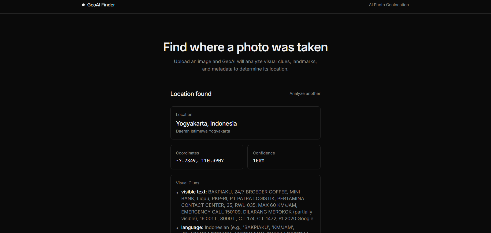

# GeoAI Finder



Privacy-first AI photo geolocation service. Upload image → detect location → image destroyed.


---

## Architecture

```
geo-location/
├── apps/
│   ├── web/              Next.js 14 (App Router) — frontend
│   └── api/              Fastify 4 — backend API
├── packages/
│   ├── ai-client/        Gemini 2.5 Flash vision client
│   ├── geo-engine/       Location verification + sanitization
│   └── shared/           Zod schemas, types, constants
├── turbo.json            Turborepo pipeline config
└── package.json          pnpm workspace root
```

## Privacy — Zero Storage

**No database. No disk writes. No history.**

| Step | What happens |
|------|-------------|
| 1. Upload | Image read into memory buffer |
| 2. Validate | MIME type + file signature + size (<10MB) |
| 3. EXIF scan | GPS coordinates extracted if present |
| 4. AI vision | Gemini 2.5 Flash analyzes image (no GPS only) |
| 5. Buffer wipe | `buffer.fill(0)` — memory zeroed immediately |

> **Every byte erased.** No cron job, no cleanup needed.

## Prerequisites

| Dependency | Version | Why |
|------------|---------|-----|
| Node.js | >= 20 | Runtime |
| pnpm | >= 9 | Workspace monorepo |
| Redis | >= 6 | Ephemeral job state (auto-expire 5min) |
| Gemini API key | — | Vision AI (Google AI / Google Cloud) |

## Setup

### 1. Install dependencies

```bash
pnpm install
```

### 2. Configure environment variables

**`apps/api/.env`:**

```env
# Redis (required)
REDIS_URL=redis://localhost:6379

# Gemini API
GEMINI_API_KEY=your-gemini-api-key
GEMINI_MODEL=gemini-2.5-flash

# Server
CORS_ORIGIN=http://localhost:3000
API_PORT=4000
API_HOST=0.0.0.0
LOG_LEVEL=info
```

**`apps/web/.env.local`:**

```env
NEXT_PUBLIC_API_URL=http://localhost:4000
```

### 3. Start development

```bash
pnpm dev
```

| Service | URL |
|---------|-----|
| Frontend | http://localhost:3000 |
| API | http://localhost:4000 |
| Health check | http://localhost:4000/health |

## API Reference

### `POST /api/analyze`

Upload image for analysis.

- **Content-Type:** `multipart/form-data`
- **Field:** `file` (image)
- **Rate limit:** 10 requests/minute

**Response `202 Accepted`:**

```json
{ "id": "uuid", "status": "pending" }
```

### `GET /api/analyze/:id`

Poll for result.

- **TTL:** 5 minutes (auto-expires)
- **Poll interval:** 2 seconds recommended

**Response `200 OK`:**

```json
{
  "status": "completed",
  "location": {
    "country": "United States",
    "region": "California",
    "city": "San Francisco",
    "latitude": 37.7749,
    "longitude": -122.4194
  },
  "confidence": 0.95,
  "clues": [
    { "category": "language", "detail": "English text on storefront" },
    { "category": "architecture", "detail": "Victorian-style houses" }
  ],
  "explanation": "English language, temperate climate, and Victorian architecture suggest San Francisco, California.",
  "modelUsed": "gemini-2.5-flash"
}
```

**Response `404 Not Found`:** (expired or invalid ID)

```json
{ "error": "Analysis not found" }
```

### `GET /health`

```json
{ "status": "ok" }
```

## Security

| Measure | Detail |
|---------|--------|
| Zero image storage | Memory buffer only, `fill(0)` after processing |
| File validation | MIME check + magic bytes signature + max 10MB |
| Rate limiting | 100 req/min global, 10 uploads/min per IP |
| Headers | Helmet (CSP disabled for Leaflet tiles) |
| CORS | Restricted to frontend origin |
| No key exposure | API key server-side only, never in bundle |
| UUID instead of filename | No original file metadata leaked |
| Redis auto-expire | Jobs expire after 5 minutes |

## Tech Stack

| Layer | Tech |
|-------|------|
| Frontend | Next.js 14.2, TypeScript, Tailwind CSS 3.4, react-leaflet 4.2, GSAP 3.12 |
| Backend | Fastify 4.28, TypeScript, exifr 7.1, ioredis 5.4, zod 3.23 |
| Vision AI | Gemini 2.5 Flash via `generativelanguage.googleapis.com` |
| Job state | Redis (ephemeral, 5-min TTL, zero persistence) |
| Monorepo | pnpm workspaces 9.1, Turborepo 2.10 |

## Development

```bash
# Build all packages
pnpm build

# Run linting
pnpm lint

# Clean build artifacts
pnpm clean

# Run API + web in parallel
pnpm dev
```

## License

This project is licensed under the [MIT License](LICENSE).

## Credits

- **AI:** Gemini API (`gemini-2.5-flash`)
- **EXIF:** `exifr`

---

## Disclaimer

AI-generated geolocation results are estimates and may be inaccurate. They should not be used as the sole basis for legal, security, emergency, or other critical decisions.

This project is intended for educational, research, and legitimate purposes only. By using this software, you agree to comply with all applicable laws and regulations.

Users are solely responsible for how they use this software. The authors and contributors are not liable for any misuse of this project or for any direct, indirect, incidental, or consequential damages arising from its use.